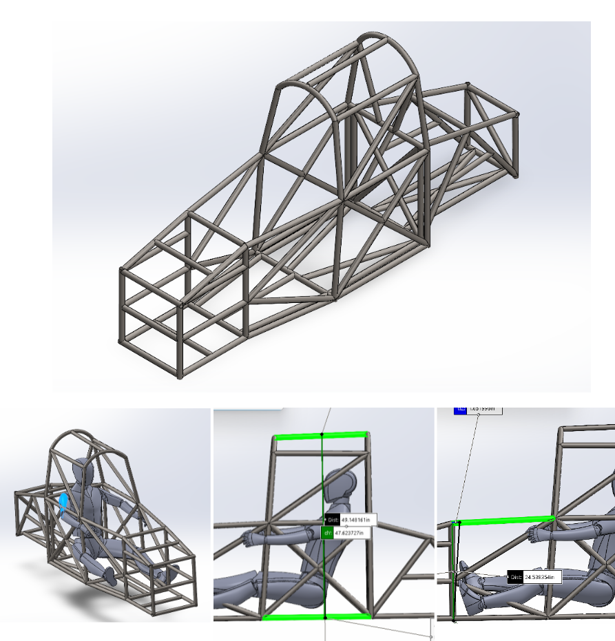
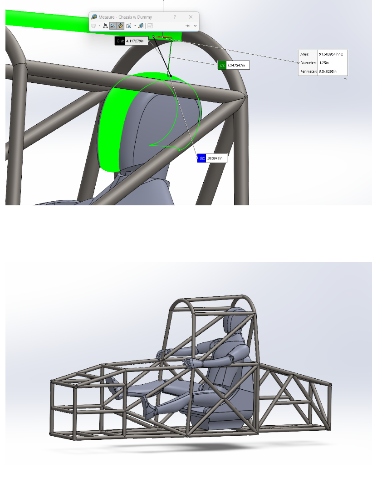
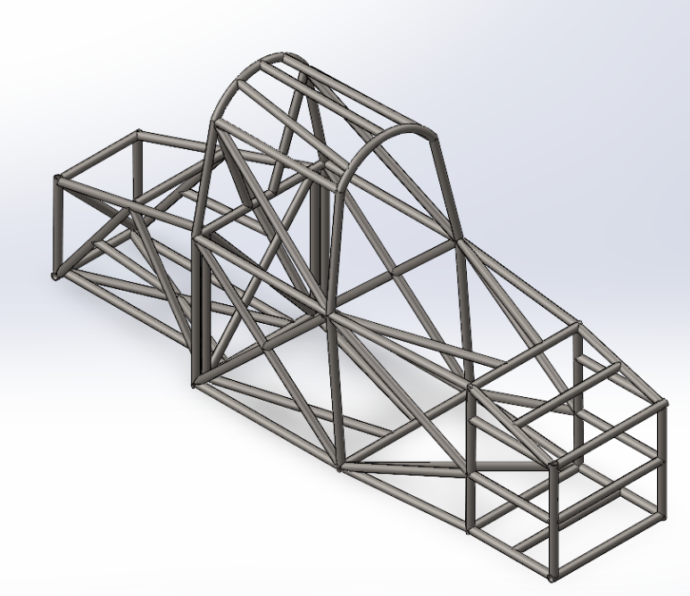
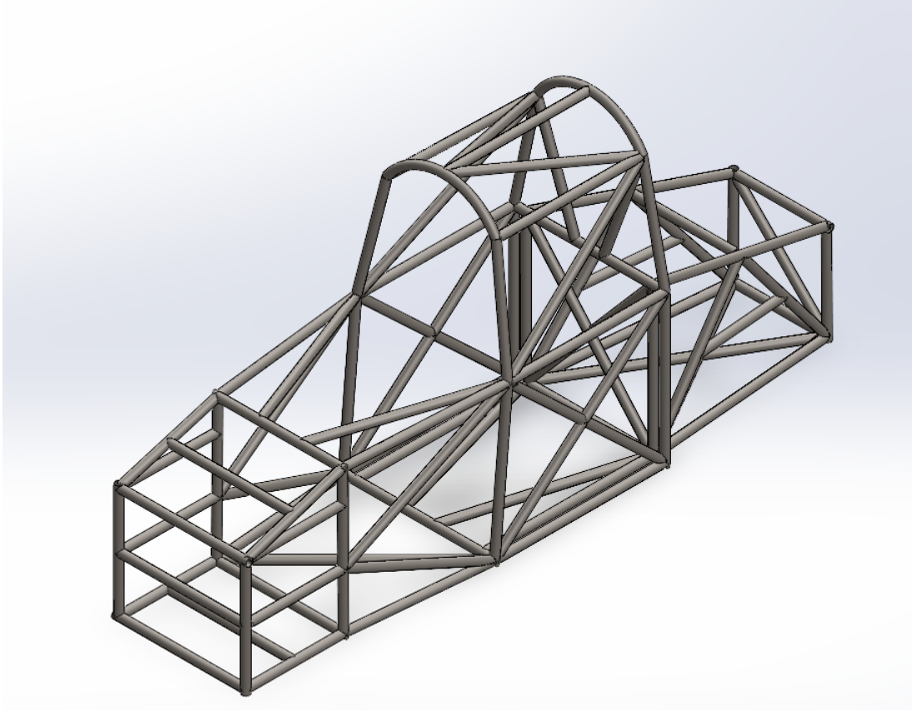
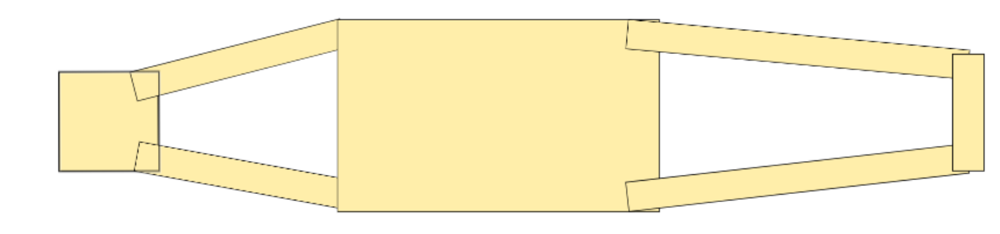
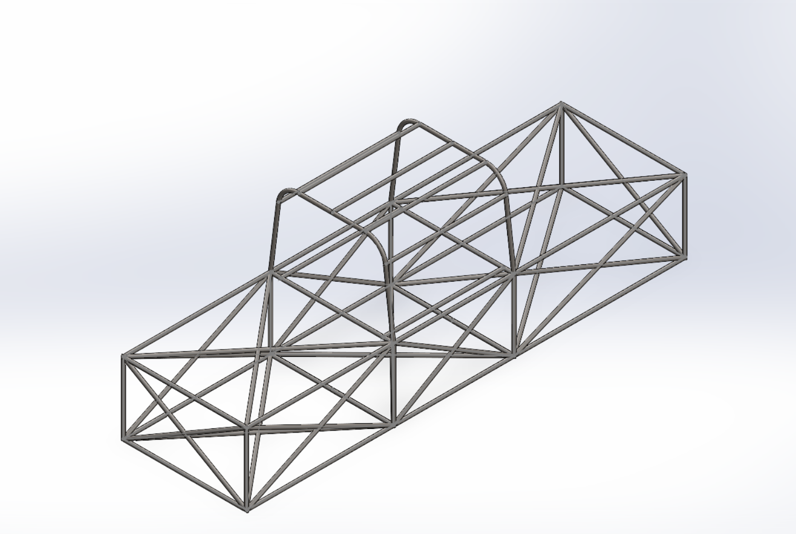

# Chassis Weldment

```
Part number:      Sol-Ch-1000-1
Manufacturer PN:  Not Applicable
Description:      WLD_Chassis
Current revision: v10.0.0
```

## Revision v5.0.0

### Changes
- Lowered front of chassis down to 16in
- Overall height down to 46in
- Fixed error in rear chassis where it was angled inwards, which increased volume electrical has to their stuff
- Triangulation on the bottom, front, and rear of the car has been changed
- Roll hoop has been tightened to better fit the driver, and the front roll hoop has been angled more backwards for easier egress

### Potential Future Changes
- Fix seat, Victor doesn’t believe its size

### Notes
- Seat dimensions need to be re-evaluated to clarify proper sizing of occupant cell and calm Victor still

## Revision v4.0.0



### Changes
- Over 6 inches of space reserved for rear trailing arm suspension
- Front pedal box is 20 inches long
- Increase angling inwards of the front of the chassis
- Simplified triangulation

### Potential Future Changes
- A reduction in height might need to be made to both the roll hoop and the front of the chassis, the front will go from roughly 24 in → 20, and the roll hoop from roughly 50 in → 40 in
- Bottom triangulation will probably be changed again in favor of cross bracing

### Notes
- The top of the roll hoop is already fixed, didn’t screenshot the fixed version
- The design of the roll hoop needs to be re-evaluated to ensure a more comfortable egress and also to lessen the width, and improve aerodynamics
- The height of the model is 6ft, so the chassis should comfortably seat a driver, and egress is already reasonably possible but could be made easier
- The roll front roll hoop may be pushed back with more discussion regarding that being necessary
- Seat dimensions need to be re-evaluated to clarify proper sizing of occupant cell and calm Victor
- One tube dimension is used throughout the chassis (1.25” OD, 1.17” ID, .08” Thickness)
- End caps will need to be made for the open tubes endings, likely welded on
- Victor wants a whole new car



## Revision v3.0.0



### Changes
- Moved tubes at the rear of the chassis to create space for the trailing arm suspension, roughly 6 inches of space available now for it
- Redid some of the triangulation for the roll hoop to reduce stress concentration


## Revision v2.0.0





```
Density = 0.01 grams per cubic millimeter
Mass = 67451.77 grams

Volume = 8592581.72 cubic millimeters
Surface area = 9724666.07 square millimeters 
Center of mass: ( millimeters )
  X = -0.13
  Y = -98.29
  Z = -343.84
```

### Changes
- Angled front Roll Hoop back
- Made the car generally smaller, in particular, reduced width significantly and height from the bottom of the car
- Added a “pedal box” for easier mounting and design for VD
- Angled the front and rear of chassis inwards, easier to create positive caster angle
- Significantly reduced size of roll hoops and occupant cell, adding greater triangulation on it as well as the rest of the chassis

### Potential Future Changes
- Increase angle of front roll hoop and further narrow the front of the chassis
- Reduce height of the front of the chassis
- Rear support bar for roll hoop
- Add gussets to reinforce roll hoop or other areas of need (might just be for tabs)
- Reduce members used in triangulation
- Reduce size of bracing tubes

### Todo
- Assess the effectiveness of triangulation in a tube chassis by analyzing torsional stiffness, stress distribution, and deflection under load, ensuring that the chassis resists twisting and bending effectively
- Identify center of mass
- Await additional input from leads on potential future changes, in particular to mounting various components and systems or plans for iteration #3
- Upload current and past iteration to github

### Final Notes
Although I believe some changes could still be made in particular to the bracing tubes and simplification of the triangulation, overall, this looks like a pretty huge step forward from the last chassis. It should be noted that the angling done as well as triangulation is still done arbitrarily, but is based on research done and reference to other teams cars. Weight is down significantly from 278 pounds to 149 pounds. VD can now start on suspension with actual mounting points present on the car, with surfaces available for both wishbone suspension in the front, and rear trailing arm suspension as well. The occupant cell has been considerably reworked and the original “No Go Zone” has been almost entirely dismissed in favor of better fitting to our drivers.

The occupant cell should still comfortably fit the seat outline Connor made, and other subsystems should be checking the file when available to identify their own mounting respectively. The tube coping needs to be double checked to make sure tubes aren’t clipping into each other.

## Revision v1.0.0



```
Density = 0.01 grams per cubic millimeter
Mass = 126352.60 grams
Volume = 16095873.13 cubic millimeters
Surface area = 16724159.07 square millimeters 

Center of mass: ( millimeters )
  X = 0.00
  Y = -45.64
  Z = -28.16 
```

### Changes to be made for next iteration
- Run Ansys sim
- Angle front roll hoop back
- Significantly narrow front section
- Moderately narrow rear section
- Tighten roll hoops closer to driver head
- Potentially reduce tube thickness for both main members and brace members
- Analyze effectiveness, position, and quantity of bracing members + Whatever information simulation gives

### From Connor
- I think the front section should be narrowed like said above, but additionally the entire bottom of the car can be shrunk so the entire chassis looks like an upside-down trapezoid. Saves weight and is better aerodynamically. Also, I think for rigidity in egress directions, I think a small metal support triangle on either side by the drivers cockpit could be implemented so drivers can take a small step before jumping out.
- Perhaps we could use a lighter steel? Is there anything lighter with similar strength properties? I suppose cheaper is also important too.
- The driver cockpit doesn’t need to be too big since the legs and such will be under the “hood” of the car. I believe we can greatly reduce the overall area that the cockpit takes up to minimize weight.

### From Vic
- From the top I say from left to right we make 2 cubes where the first is where the pedals will be then the seat then just shrink enough for the battery.
